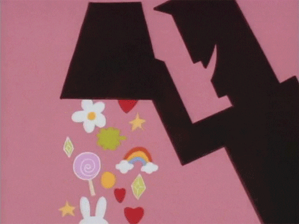
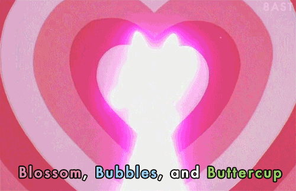

    

# The Powerpuff Girls - Memory Game

Açúcar, tempero e tudo que há de bom... Estes foram os ingredientes escolhidos para criar as garotinhas perfeitas, mas o professor Utônio, acidentalmente, acrescentou um ingrediente extra na mistura: *O elemento X*! 

    

E assim nasceram **As Meninas Superpoderosas**, usando seus ultra-super poderes!
**Florzinha**, **Lindinha** e **Docinho**, têm dedicado suas vidas combatendo o crime, e as forças do mal!

    

## Tecnologias utilizadas
- Javascript
- CSS
- HTML

## Sobre

Atividade avaliativa desenvolvida como requisito parcial para obtenção da nota do 1º bimestre letivo na disciplina de **Programação para Internet (PPI)**, do curso de Informática do IFRN - *Campus* Santa Cruz.

Orientador: [Marcelo Júnior](https://github.com/MimMarcelo)
 
